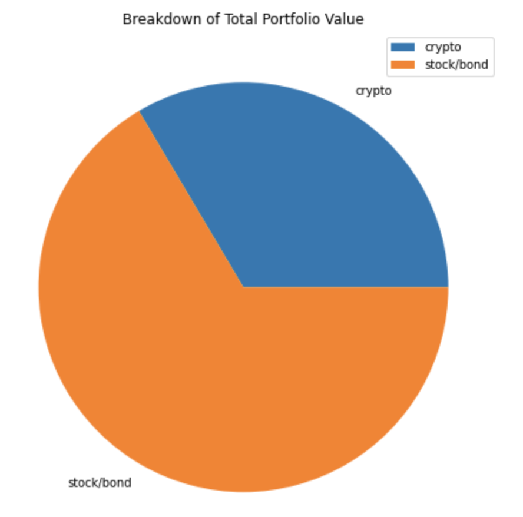

# Module_5 Challenge - Financial Planning Tools

I’ve decided to start a fintech consulting firm that focuses on projects to benefit local communities. I just won my first contract with a large credit union. The project entails building a tool to help credit union members evaluate their financial health. Specifically, the credit union board wants the members to be able to do two things. First, they should be able to assess their monthly budgets. Second, they should be able to forecast a reasonably effective retirement plan based on their current holdings of cryptocurrencies, stocks, and bonds. The chief technology officer (CTO) of the credit union wants me to develop a prototype application to present at its next assembly.  I'll be creating two financial analysis tools - one for emergencies, one for retirement. 

---

## Technologies

This project leverages python 3.7.11 with the following packages:

* [pandas](https://pandas.pydata.org) - Use the Pandas library, along with JupyterLab, to collect, prepare and analyze data.

* [os](https://docs.python.org/3/library/os.html) - This module provides a portable way of using operating system dependent funcionality.

* [json](https://docs.python.org/3/library/json.html) - Lightweight data interchange format.

* [requests](https://pypi.org/project/requests/) - An elegant and simple HTTP library for Python.

* [dotenv](https://pypi.org/project/python-dotenv/) - Reads key-value pairs from a .env file and can set them as environment variables.

* [alpaca_trade_api](https://pypi.org/project/alpaca-trade-api/) - Allows rapid trading algo development easily.

* [MCForecastTools] - Runs Monte Carlo simulations on financial Pandas data frames.

* [matplotlib](https://matplotlib.org) - For plotting the data on line graphs and box plots.

* [datetime] and [BDay] - Used to calculate the current date as well as the previous business day.  Rather than hardcoding dates during our data collection process, we'll use the most recent market close data.

---

## Installation Guide

Before running the application first import the following libraries:

```python
  import os
  import requests
  import json
  import pandas as pd
  from dotenv import load_dotenv
  import alpaca_trade_api as tradeapi
  from MCForecastTools import MCSimulation

  %matplotlib inline

  import datetime
  from pandas.tseries.offsets import BDay
```

---

## Usage and Summary Analysis

The financial planner for emergencies will allow members to visualize their current savings and then determine if they have enough reserves for an emergency fund.

   

The financial planner for retirement will forecast the performance of their retirement portfolio for 30 years.  The tool will make an Alpaca API call via the Alpaca SDK to get historical price data for use in Monte Carlo simulations.

   
    
   

---

## Contributors

Starter code was provided by UW Fintech Bootcamp.  Updates and analysis by Jason Buckholt.  

---

## License

MIT License

Copyright (c) 2022 Jason Buckholt

Permission is hereby granted, free of charge, to any person obtaining a copy of this software and associated documentation files (the "Software"), to deal in the Software without restriction, including without limitation the rights to use, copy, modify, merge, publish, distribute, sublicense, and/or sell copies of the Software, and to permit persons to whom the Software is furnished to do so, subject to the following conditions:

The above copyright notice and this permission notice shall be included in all copies or substantial portions of the Software.

THE SOFTWARE IS PROVIDED "AS IS", WITHOUT WARRANTY OF ANY KIND, EXPRESS OR IMPLIED, INCLUDING BUT NOT LIMITED TO THE WARRANTIES OF MERCHANTABILITY, FITNESS FOR A PARTICULAR PURPOSE AND NONINFRINGEMENT. IN NO EVENT SHALL THE AUTHORS OR COPYRIGHT HOLDERS BE LIABLE FOR ANY CLAIM, DAMAGES OR OTHER LIABILITY, WHETHER IN AN ACTION OF CONTRACT, TORT OR OTHERWISE, ARISING FROM, OUT OF OR IN CONNECTION WITH THE SOFTWARE OR THE USE OR OTHER DEALINGS IN THE SOFTWARE.
